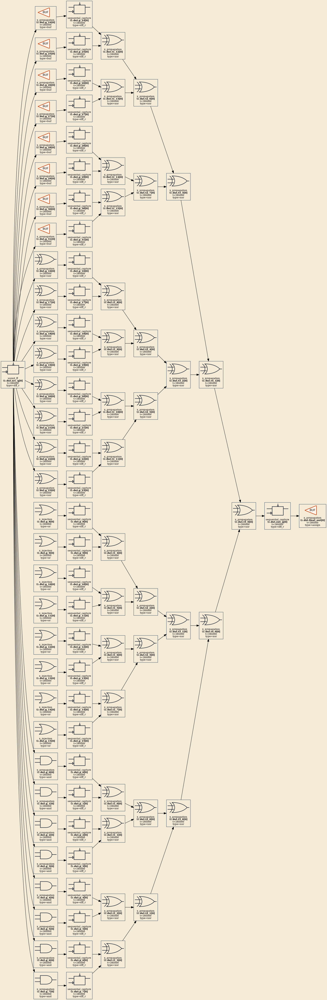

# X-Tracer

Root-cause analysis for X (unknown) values in Verilog gate-level simulations.

Given a gate-level netlist, a VCD waveform, and a signal that is `X` at a
specific time, X-Tracer traces backward through the netlist to produce a
**cause tree** — a complete explanation of where the X originated.

No open-source tool for this exists.

## Features

- **Backward X-tracing** through combinational and sequential logic
- **Bit-level precision** — tracks individual bits through buses, muxes, and bit slices
- **Cause tree output** — shows the full chain from query signal to root cause
- **Gate model** with IEEE 1364 X-propagation rules, including controlling-value masking
- **Standard cell support** — strips PDK prefixes and drive strength suffixes to recognize base cell functions (tested with Sky130)
- **Sequential handling** — traces through DFFs and latches with correct clock edge timing
- **Multiple output formats** — text (human-readable), JSON (machine-readable), DOT (Graphviz)
- **Fast VCD parsing** — Rust-backed pywellen for large files, pure-Python pyvcd fallback
- **Full SystemVerilog parsing** — pyslang handles any construct without crashing

## Root Cause Types

| Type | Meaning |
|------|---------|
| `primary_input` | Signal has no driver — X enters at the design boundary |
| `uninit_ff` | Flip-flop/latch was never initialized |
| `x_injection` | X was externally injected (force/deposit) — driver output disagrees with VCD |
| `sequential_capture` | FF captured X from its D input at a clock edge |
| `clock_x` | Clock/enable signal is X — FF output becomes X |
| `async_control_x` | Async reset or set is X |
| `multi_driver` | Multiple drivers on a net produce unresolvable X |
| `x_propagation` | X propagated through a combinational gate (intermediate node) |
| `unknown_cell` | Cell type not recognized — conservative fallback used |

## Installation

Requires Python 3.10+, a C++ compiler (for pyslang wheels), and [Icarus Verilog](http://iverilog.icarus.com/) (`iverilog`) for running tests.
For fast VCD parsing (optional), a Rust toolchain is also needed — install via [rustup](https://rustup.rs).

```bash
# Clone
git clone https://github.com/kuchlous/x-tracer.git
cd x-tracer

# Install dependencies
pip install pyslang pyvcd click pytest

# Optional: install pywellen for fast VCD parsing (10-50x faster)
# Requires Rust toolchain (https://rustup.rs) and maturin
git clone https://github.com/kuchlous/wellen.git
cd wellen/pywellen
pip install maturin
maturin develop
cd ../..

# Verify
python3 -m pytest tests/test_*.py -q
```

## Usage

```bash
python3 x_tracer.py \
  -n <netlist.v> [-n <cells.v> ...] \
  -v <sim.vcd> \
  -s <signal> \
  -t <time_ps> \
  [-f text|json|dot] \
  [--dot-direction forward|backward] \
  [--max-depth 100]
```

### Arguments

| Flag | Description |
|------|-------------|
| `-n, --netlist` | Verilog netlist file(s). Pass multiple times for multiple files. Include the testbench if VCD paths use testbench hierarchy (e.g., `tb.dut.*`). |
| `-v, --vcd` | VCD waveform file from simulation |
| `-s, --signal` | Query signal in `path[bit]` format (e.g., `tb.dut.result[3]`) or scalar format (e.g., `tb.dut.clk`) |
| `-t, --time` | Query time in picoseconds |
| `-f, --format` | Output format: `text` (default), `json`, or `dot` |
| `--dot-direction` | DOT edge direction: `forward` schematic-style cause-to-effect flow (default) or `backward` raw cause-tree flow |
| `--max-depth` | Maximum backward trace depth (default: 100) |
| `--top-module` | Top module name, auto-detected if omitted |

### Examples

**Trace an X through a combinational gate:**

```bash
python3 x_tracer.py \
  -n design.v -n tb.v \
  -v sim.vcd \
  -s "tb.dut.y[0]" -t 30000
```

```
[x_propagation] tb.dut.y[0] @ t=30000 (gate=and, inst=tb.dut.g0)
  [primary_input] tb.dut.b[0] @ t=30000
```

**Trace through a chain of flip-flops:**

```bash
python3 x_tracer.py \
  -n netlist.v -n tb.v \
  -v sim.vcd \
  -s "tb.dut.ff7.Q[0]" -t 240000
```

```
[sequential_capture] tb.dut.ff7.Q[0] @ t=240000 (gate=dff_r, inst=tb.dut.ff7)
  [sequential_capture] tb.dut.q6[0] @ t=235000 (gate=dff_r, inst=tb.dut.ff6)
    [sequential_capture] tb.dut.q5[0] @ t=225000 (gate=dff_r, inst=tb.dut.ff5)
      ...
              [uninit_ff] tb.dut.q0[0] @ t=175000 (gate=dff_r, inst=tb.dut.ff0)
```

**Trace reconvergent fanout (two paths from one source):**

```bash
python3 x_tracer.py \
  -n netlist.v -n tb.v \
  -v sim.vcd \
  -s "tb.dut.out[0]" -t 30000
```

```
[x_propagation] tb.dut.out[0] @ t=30000 (gate=and, inst=tb.dut.merge_gate)
  [x_propagation] tb.dut.a3[0] @ t=30000 (gate=buf, inst=tb.dut.ga3)
    ...
          [primary_input] tb.dut.src[0] @ t=30000
  [x_propagation] tb.dut.b3[0] @ t=30000 (gate=buf, inst=tb.dut.gb3)
    ...
          [primary_input] tb.dut.src[0] @ t=30000
```

**JSON output for scripting:**

```bash
python3 x_tracer.py -n design.v -n tb.v -v sim.vcd \
  -s "tb.dut.y[0]" -t 30000 -f json | python3 -m json.tool
```

**DOT output for visualization:**

```bash
python3 x_tracer.py -n design.v -n tb.v -v sim.vcd \
  -s "tb.dut.y[0]" -t 30000 -f dot > trace.dot

dot -Tpng trace.dot -o trace.png
```

DOT output defaults to a forward schematic-style view: causal inputs are placed
on the left and flow toward the queried X output on the right. Use
`--dot-direction backward` to get the raw cause-tree view where the queried X
output points backward to its causes.

DOT node labels include:

- Cause type, signal, query time, and `type=<cell_type>` when a driving cell is known
- A warm non-white graph background for readability
- Bold last-two hierarchy components in signal names, e.g. `tb.<B>dut.final_out[0]</B>`

**Iconized DOT and PNG output:**

The CLI emits plain DOT. To add cell icons, post-process the DOT with
`tools/iconize_dot.py`. Known icons live in `x-tracer-icons/`; unknown cell
types remain text-only and still render.

```bash
python3 x_tracer.py \
  -n tests/cases/stress_edge/wide_fanout/netlist.v \
  -n tests/cases/stress_edge/wide_fanout/tb.v \
  -v tests/cases/stress_edge/wide_fanout/sim.vcd \
  -s "tb.dut.final_out" \
  -t 295000 \
  --max-depth 300 \
  -f dot > /tmp/x-tracer-wide-fanout-plain.dot

python3 tools/iconize_dot.py \
  /tmp/x-tracer-wide-fanout-plain.dot \
  /tmp/x-tracer-wide-fanout.dot

dot -Tpng /tmp/x-tracer-wide-fanout.dot \
  -o /tmp/x-tracer-wide-fanout.png
```

Sample output is here `x-tracer-wide-fanout.png`

Run `dot` from the repository root when the DOT references relative icon paths
like `x-tracer-icons/dff_r.png`. The default icon mapping is:

| Cell type | Icon |
|-----------|------|
| `assign` | `x-tracer-icons/buf.png` |
| `buf` | `x-tracer-icons/buf.png` |
| `dff_r` | `x-tracer-icons/dff_r.png` |
| `and` | `x-tracer-icons/and.png` |
| `or` | `x-tracer-icons/or.png` |
| `xor` | `x-tracer-icons/xor.png` |

Regenerate the standard icon PNGs with:

```bash
python3 x-tracer-icons/generate_standard_icons.py
```

## Important Notes

### Include the testbench

If your VCD uses testbench hierarchy (signal paths like `tb.dut.signal`),
you must include the testbench file with `-n tb.v` so the parser builds the
correct hierarchy. Without it, the netlist paths won't match the VCD paths
and you'll get:

```
Error: Signal 'tb.dut.sig' found in VCD but not in the netlist.
Try including the testbench file with -n tb.v
```

### Cell libraries

For post-synthesis netlists that instantiate standard cells (e.g.,
`sky130_fd_sc_hd__and2_1`), the parser works in two modes:

1. **With cell library Verilog**: Pass the cell model files with `-n cells.v`.
   The parser extracts port directions from the cell definitions.

2. **Without cell library**: The parser infers port directions from naming
   conventions (Y/X/Z/Q are outputs, everything else is inputs). This works
   for most standard cell libraries but may mis-classify unusual port names.

### VCD requirements

- VCD must be generated with `$dumpvars(0, <top>)` to capture the full hierarchy
- For designs with sub-cells containing registers (DFFs), ensure internal signals
  are dumped (e.g., `$dumpvars(0, tb.dut.ff0)`)

## Architecture

```
┌──────────────┐    ┌──────────────┐
│ Netlist       │    │ VCD          │
│ Parser        │    │ Database     │
│ (pyslang)     │    │ (pywellen)   │
└──────┬───────┘    └──────┬───────┘
       │                    │
       ▼                    ▼
┌──────────────────────────────────┐
│ Connectivity Graph (plain dicts) │
│ + Gate Model (table-driven)      │
└──────────────┬───────────────────┘
               │
               ▼
┌──────────────────────────────────┐
│ X-Tracer Core Algorithm          │
│ BFS backward through input cone  │
│ Memoized (signal, time) pairs    │
│ Sequential: async → clock → D    │
└──────────────┬───────────────────┘
               │
               ▼
         XCause tree → text/json/dot
```

### Modules

| Module | Location | Purpose |
|--------|----------|---------|
| Netlist Parser | `src/netlist/` | pyslang-based Verilog parser → connectivity graph |
| VCD Database | `src/vcd/` | Waveform loading with O(log n) time-value lookup |
| Gate Model | `src/gates/` | X-propagation rules for 30+ gate/cell types |
| Tracer Core | `src/tracer/` | Backward tracing algorithm with cause tree construction |
| CLI | `src/cli/` | Command-line interface and output formatters |

## Testing

The project includes a golden testcase suite (392 cases) covering:

- **S1 (gates)**: Every Verilog primitive with all relevant input combinations (302 cases)
- **S2 (structural)**: Carry chains, FF chains, reconvergent fanout, mux trees, reset chains, bus encoders (23 cases)
- **S3 (multibit)**: Partial bus injection, bit slicing, shift registers, reduction operators (67 cases)

```bash
# Run all unit + integration tests
python3 -m pytest tests/test_*.py -v

# Run the testcase validator (checks all golden cases)
python3 tests/validate.py
```

## Adding New Cell Types

The gate model is table-driven. Where you add a new cell depends on what kind it is:

| Cell kind | Where to edit |
|-----------|---------------|
| Verilog primitive (e.g. a new tri-state variant) | `src/gates/primitives.py` + `src/gates/model.py` |
| Standard cell family (e.g. `aoi32`, a new MUX size) | `src/gates/cells.py` |
| New PDK naming convention (e.g. `mycorp_sc__`) | `src/gates/cells.py` (`_PDK_PREFIXES`) |

### 1. New PDK prefix (simplest case)

If the cell functions already exist but use an unfamiliar prefix, add it to `_PDK_PREFIXES` in `src/gates/cells.py:13`. `strip_cell_name` will then strip it before matching against the family patterns:

```python
_PDK_PREFIXES = [
    'sky130_fd_sc_hd__',
    ...
    'mycorp_sc__',  # new
]
```

Verify with a quick cell type stripped correctly:
```python
from src.gates.cells import strip_cell_name
assert strip_cell_name('mycorp_sc__and2_4') == 'and2'
```

### 2. New standard cell family

Three places in `src/gates/cells.py`:

**a. `identify_cell`** — return a `CellInfo` when the stripped name matches. Examples already there: AOI/OAI regex groups, MUX2/MUX4, half/full adder, majority, tie cells, clock gates, DFF/latch.

```python
# New family "xyz3": 3-input custom gate
if base in ('xyz3',):
    return CellInfo('xyz3')
```

**b. `forward_cell`** — compute the output `'0'|'1'|'x'|'z'` from the `inputs` dict. Use the existing helpers in `src/gates/primitives.py` (`eval_and`, `eval_or`, `eval_xor`, …) and `_norm` to handle `z → x` folding.

```python
if fam == 'xyz3':
    a = P._norm(inputs.get('A', 'x'))
    b = P._norm(inputs.get('B', 'x'))
    c = P._norm(inputs.get('C', 'x'))
    return P.eval_and([a, P.eval_or([b, c])])
```

**c. `backward_cell`** — return the list of X-valued input ports that are *causally responsible* for the output being X. This is what drives the cause tree. For simple gates, delegate to the primitive `backward_*` helpers; for anything with a controlling value (AND/OR-style) only return inputs whose change could have flipped the output.

```python
if fam == 'xyz3':
    # Conservative fallback: all X inputs are causal
    return [p for p, v in inputs.items() if P._norm(v) == 'x']
```

A conservative `backward_cell` (returning all X inputs) is always correct but produces wider cause trees. A precise one mirrors the gate's controlling-value logic — see `_backward_aoi` / `_backward_mux2` for examples.

### 3. New Verilog primitive

Add the truth-table helper in `src/gates/primitives.py`, then wire it up in `src/gates/model.py`:
- Add to `_PRIMITIVES` set (so `is_known_cell` reports True)
- Add to the appropriate dispatch dict (`_MULTI_INPUT_FN`, `_TRISTATE_FN`, …) or a new `if ct == '…'` branch in `forward` / `backward_causes`

### 4. Add a test

Create a minimal synthetic case under `tests/cases/synthetic/gates/` with a netlist that instantiates the new cell and a VCD where it produces X. The generator scripts under `tests/generators/` (if present) or an existing case directory (e.g. `synth_s1_and_2in_xmask01_0/`) are good templates. Then:

```bash
python3 -m pytest tests/test_tracer.py -v -k <your_case_name>
```

Unknown cells fall through to the **conservative fallback** (`unknown_cell` cause type — all X inputs marked causal), so the tracer still works without a model; adding one just gives tighter cause trees.

## Limitations (v1)

- No timing violation analysis (specify/notifier-based X)
- No strength resolution (4-state only, not 8-strength)
- No delta-cycle race detection
- Hard macros / black boxes reported as `unknown_cell`
- No UPF/CPF power intent support
- No bidirectional pad analysis

See `docs/SEMANTIC_SPEC.md` for the full specification.



## License

MIT
